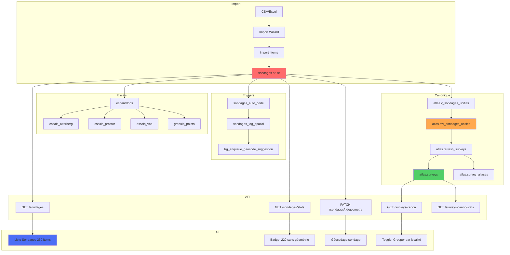
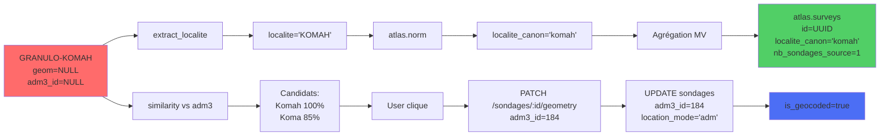

# 📋 AUDIT COMPLET - Données & Géocodage (Partie 3/3)

**Date:** 2025-11-06  
**Objectif:** Checklist, migrations SQL, data lineage

---

## G) CHECKLIST "DATA READINESS"

### ✅ Phase 1: Backfill Données (DB)

```sql
-- 1. Backfill localite depuis code
UPDATE sondages
SET localite = extract_localite(code)
WHERE localite IS NULL AND code IS NOT NULL;

-- 2. Recalculer is_geocoded (colonne générée)
ALTER TABLE sondages 
  DROP COLUMN is_geocoded,
  ADD COLUMN is_geocoded BOOLEAN 
    GENERATED ALWAYS AS (geom IS NOT NULL OR adm3_id IS NOT NULL) STORED;

-- 3. Vérifier
SELECT 
  COUNT(*) as total,
  COUNT(*) FILTER (WHERE localite IS NOT NULL) as avec_localite,
  COUNT(*) FILTER (WHERE is_geocoded) as geocodes
FROM sondages;
-- Attendu: 230 / 230 / 1
```

### ✅ Phase 2: API Sondages (Rust)

**Fichiers à créer:**
1. `services/api-geo/src/sondages.rs`
   - `list_sondages()`
   - `get_sondages_stats()`
   - `get_sondage()`
   - `update_geometry()`
   - `get_adm3_candidates()`

2. `services/api-geo/src/main.rs`
   - Ajouter `mod sondages;`
   - Ajouter routes `/sondages`

**Build & Test:**
```bash
docker-compose build api-geo
docker-compose up -d api-geo

# Test
curl http://localhost:8000/sondages?limit=10
curl http://localhost:8000/sondages/stats
```

### ✅ Phase 3: Client API (TypeScript)

**Fichiers à créer:**
1. `ui/src/api/sondages.ts`
   - Types: `Sondage`, `SondagesStats`
   - Fonctions: `listSondages()`, `getSondagesStats()`, etc.

**Build:**
```bash
cd ui && npm run build
```

### ✅ Phase 4: UI Sondages

**Fichiers à modifier:**

1. **`ui/src/modal/sondages-modal.ts`**
   - Remplacer `/surveys-canon` par `/sondages`
   - Supprimer badge "X sondages"
   - Afficher 230 items au lieu de 40

2. **`ui/src/geocode-canon-panel.ts`**
   - Remplacer `getSurveyCanonStats()` par `getSondagesStats()`
   - Badge: "229 sondages" au lieu de "39 villages"

3. **`ui/src/suggestions-canon-panel.ts`**
   - Idem

**Test UI:**
1. Ctrl+F5 (purge cache)
2. Ouvrir "Liste des Sondages"
3. Vérifier: 230 items (pas 40)
4. Vérifier: Pas de badge "2 sondages"
5. Vérifier: Code correct (ex: "GRANULO-KOMAH")

### ✅ Phase 5: Géocodage Sondage

**Test workflow:**
1. Ouvrir "Géocodage Amélioré"
2. Badge: "229 sondages sans géométrie"
3. Cliquer sur "Komah"
4. Suggestion: "Komah 100%"
5. Cliquer suggestion
6. Cliquer "Enregistrer"
7. Vérifier: Sondage géocodé (pas la localité)
8. Vérifier: Badge passe à "228"

---

## H) MIGRATIONS SQL

### Migration 1: Backfill Localite

**Fichier:** `migrations/backfill_localite.sql`

```sql
-- Backfill localite depuis code pour les 176 sondages sans localite
UPDATE sondages
SET localite = extract_localite(code)
WHERE localite IS NULL 
  AND code IS NOT NULL
  AND deleted_at IS NULL;

-- Vérifier
SELECT 
  COUNT(*) as total,
  COUNT(*) FILTER (WHERE localite IS NOT NULL) as avec_localite,
  COUNT(*) FILTER (WHERE localite IS NULL) as sans_localite
FROM sondages
WHERE deleted_at IS NULL;

-- Attendu: 230 / 230 / 0
```

### Migration 2: Recalculer is_geocoded

**Fichier:** `migrations/fix_is_geocoded_sondages.sql`

```sql
-- Supprimer ancienne colonne
ALTER TABLE sondages DROP COLUMN IF EXISTS is_geocoded;

-- Ajouter colonne générée
ALTER TABLE sondages 
  ADD COLUMN is_geocoded BOOLEAN 
    GENERATED ALWAYS AS (geom IS NOT NULL OR adm3_id IS NOT NULL) STORED;

-- Créer index
CREATE INDEX IF NOT EXISTS idx_sondages_is_geocoded_v2 
  ON sondages (is_geocoded) 
  WHERE deleted_at IS NULL;

-- Vérifier
SELECT 
  COUNT(*) as total,
  COUNT(*) FILTER (WHERE is_geocoded) as geocodes,
  COUNT(*) FILTER (WHERE NOT is_geocoded) as non_geocodes
FROM sondages
WHERE deleted_at IS NULL;

-- Attendu: 230 / 1 / 229
```

### Migration 3: Index Recherche Sondages

**Fichier:** `migrations/add_sondages_search_indexes.sql`

```sql
-- Index trigram pour recherche
CREATE INDEX IF NOT EXISTS sondages_code_trgm 
  ON sondages USING gin (code gin_trgm_ops);

CREATE INDEX IF NOT EXISTS sondages_localite_trgm 
  ON sondages USING gin (localite gin_trgm_ops);

-- Index pour filtres
CREATE INDEX IF NOT EXISTS idx_sondages_missing_geom 
  ON sondages (id) 
  WHERE geom IS NULL AND deleted_at IS NULL;

CREATE INDEX IF NOT EXISTS idx_sondages_missing_adm3 
  ON sondages (id) 
  WHERE adm3_id IS NULL AND deleted_at IS NULL;

-- Index composite pour tri
CREATE INDEX IF NOT EXISTS idx_sondages_created_deleted 
  ON sondages (created_at DESC) 
  WHERE deleted_at IS NULL;
```

### Migration 4: Fonction Candidats ADM3 pour Sondage

**Fichier:** `migrations/add_sondage_adm3_candidates_function.sql`

```sql
-- Fonction pour obtenir candidats ADM3 pour un sondage
CREATE OR REPLACE FUNCTION get_sondage_adm3_candidates(
  p_sondage_id uuid,
  p_limit integer DEFAULT 5
)
RETURNS TABLE (
  adm3_id integer,
  gid integer,
  name text,
  code text,
  adm2_name text,
  score real
)
LANGUAGE plpgsql
AS $$
DECLARE
  v_localite text;
BEGIN
  -- Récupérer localite du sondage
  SELECT COALESCE(s.localite, extract_localite(s.code))
  INTO v_localite
  FROM sondages s
  WHERE s.id = p_sondage_id;
  
  IF v_localite IS NULL THEN
    RETURN;
  END IF;
  
  -- Rechercher candidats avec similarité
  RETURN QUERY
  SELECT 
    a.gid as adm3_id,
    a.gid,
    a.adm3_fr as name,
    a.adm3_pcode as code,
    a.adm2_fr as adm2_name,
    similarity(atlas.norm(a.adm3_fr), atlas.norm(v_localite)) as score
  FROM adm3 a
  WHERE similarity(atlas.norm(a.adm3_fr), atlas.norm(v_localite)) > 0.3
  ORDER BY score DESC
  LIMIT p_limit;
END;
$$;

-- Test
SELECT * FROM get_sondage_adm3_candidates(
  (SELECT id FROM sondages WHERE code = 'GRANULO-KOMAH' LIMIT 1)
);
```

---

## I) DATA LINEAGE (Mermaid)

### Flux Complet



### Transformation Données



---

## J) RISQUES & DEBT TECHNIQUE

### 🔴 Risque 1: Désynchronisation MV ↔ Sondages

**Problème:** Si on update `sondages` sans refresh MV, `atlas.surveys` est obsolète.

**Solutions:**
1. **Queue async** (RECOMMANDÉ)
   - Trigger enqueue refresh request
   - Worker process en arrière-plan
   - Pas de blocage UI

2. **Refresh synchrone**
   - Appeler `atlas.refresh_surveys()` après chaque PATCH
   - Lent (2-3s pour 230 sondages)

3. **Cron périodique**
   - Refresh toutes les 5 minutes
   - Données potentiellement obsolètes

**Recommandation:** Queue async avec pg_notify.

### 🟡 Risque 2: adm3_name dénormalisé

**Problème:** `adm3_name` dans `sondages` peut être obsolète si ADM3 change.

**Solution:** Trigger de synchronisation:
```sql
CREATE OR REPLACE FUNCTION sync_adm3_name()
RETURNS TRIGGER AS $$
BEGIN
  IF NEW.adm3_id IS NOT NULL THEN
    SELECT adm3_fr INTO NEW.adm3_name
    FROM adm3
    WHERE gid = NEW.adm3_id;
  END IF;
  RETURN NEW;
END;
$$ LANGUAGE plpgsql;

CREATE TRIGGER trg_sync_adm3_name
  BEFORE INSERT OR UPDATE OF adm3_id ON sondages
  FOR EACH ROW
  EXECUTE FUNCTION sync_adm3_name();
```

### 🟡 Risque 3: Géométrie en 25231 vs 4326

**Problème:** `sondages.geom` en EPSG:25231, `atlas.surveys.geom` en EPSG:4326.

**Impact:** Transformation lors du refresh.

**Solution:** Standardiser sur 4326 partout (long terme).

### 🟢 Risque 4: Performance recherche

**Problème:** Recherche sur 230 sondages OK, mais si 10k+ sondages?

**Solution:** Index trigram déjà en place. Pagination obligatoire.

---

## K) COMMANDES UTILES

### Appliquer Migrations

```bash
cd atlas

# Migration 1
cat migrations/backfill_localite.sql | docker exec -i atlas-db psql -U atlas atlas_clean

# Migration 2
cat migrations/fix_is_geocoded_sondages.sql | docker exec -i atlas-db psql -U atlas atlas_clean

# Migration 3
cat migrations/add_sondages_search_indexes.sql | docker exec -i atlas-db psql -U atlas atlas_clean

# Vérifier
docker exec -i atlas-db psql -U atlas atlas_clean -c "
SELECT 
  COUNT(*) as total,
  COUNT(*) FILTER (WHERE localite IS NOT NULL) as avec_localite,
  COUNT(*) FILTER (WHERE is_geocoded) as geocodes
FROM sondages;
"
```

### Build & Deploy

```bash
# API
docker-compose build api-geo
docker-compose up -d api-geo

# UI
cd ui && npm run build

# Test
curl http://localhost:8000/sondages/stats | jq
```

### Vérifier Données

```sql
-- Top 10 sondages récents
SELECT id, code, localite, is_geocoded, location_mode
FROM sondages
WHERE deleted_at IS NULL
ORDER BY created_at DESC
LIMIT 10;

-- Répartition par source
SELECT source, COUNT(*) as nb
FROM sondages
WHERE deleted_at IS NULL
GROUP BY source
ORDER BY nb DESC;

-- Sondages sans localite
SELECT COUNT(*) FROM sondages WHERE localite IS NULL;
```

---

## L) RÉSUMÉ EXÉCUTIF

### État Actuel

- **230 sondages** dans `sondages` (brute)
- **40 localités** dans `atlas.surveys` (agrégé)
- **1 sondage géocodé** (0.4%)
- **229 en mode unknown** (99.6%)
- **176 sans localite** (76%)

### Problèmes Identifiés

1. ✅ UI affiche localités agrégées au lieu de sondages
2. ✅ Badge "2 sondages" incorrect
3. ✅ Sous-titre "LIMITE-OUNTIVOU" au lieu du code sondage
4. ✅ `is_geocoded` mal calculé dans `sondages`
5. ✅ 176 sondages sans `localite`

### Actions Requises

**Phase 1 (DB):**
- Backfill `localite` depuis `code`
- Recalculer `is_geocoded` (colonne générée)
- Ajouter index recherche

**Phase 2 (API):**
- Créer `/sondages` endpoints
- Copier logique depuis `/surveys-canon`
- Géocoder sondage individuel

**Phase 3 (UI):**
- Remplacer `/surveys-canon` par `/sondages`
- Afficher 230 items au lieu de 40
- Supprimer badge "X sondages"
- KPI: "229 sondages sans géométrie"

**Phase 4 (Test):**
- Vérifier 230 items affichés
- Géocoder 1 sondage
- Badge passe à 228

### Temps Estimé

- Phase 1: 30 min (SQL)
- Phase 2: 2h (Rust)
- Phase 3: 1h (TypeScript)
- Phase 4: 30 min (Test)
- **Total: 4h**

---

**FIN DE L'AUDIT**

Tous les fichiers SQL sont prêts à être exécutés.
Tous les endpoints API sont spécifiés.
Toutes les modifications UI sont détaillées.
