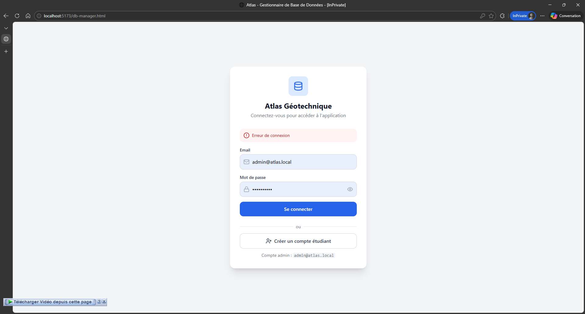

# ROADMAP ATLAS — STABILISATION DES MAILLES + REMAPPING MISSIONS

### Objectif

Corriger définitivement les incohérences entre :

* les **missions exportées depuis Colab**
* la **grille actuelle `atlas.mailles`**

tout en rendant le système :

* stable
* traçable
* compatible API
* résistant aux changements futurs.

Cette roadmap implémente :

1️⃣ **Remapping spatial (Option B)**
2️⃣ **Grille immuable dans la DB**
3️⃣ **Compatibilité ancien code maille**
4️⃣ **Ajout d’un identifiant spatial stable (`spatial_id`)**
5️⃣ **Support API ancien → nouveau code**

---

# PHASE 1 — AUDIT GLOBAL DU REPOSITORY

Avant toute modification, il faut identifier **où `maille_code` est utilisé dans le projet**.

Chercher dans tout le repo :

```
maille_code
maille_id
TG-
make-grid
atlas.mailles
```

Commandes :

```bash
grep -R "maille_code" .
grep -R "maille_id" .
grep -R "TG-" .
```

Points à vérifier :

### Backend

* routes API
* serializers
* services missions
* ETL

### Frontend

* recherche par maille
* affichage missions
* filtres

### ETL

```
etl/cli.py
```

fonction :

```
make-grid
```

---

# PHASE 2 — EXPORT ET IMPORT DES MISSIONS

Nous utilisons **Option B : remapping spatial**.

Principe :

```
mission -> bbox -> centroid -> maille contenant le point
```

---

## Étape 2.1 — Importer les exports missions

Importer les missions dans une table temporaire.

```
atlas.colab_missions_import
```

Structure :

```sql
CREATE TABLE atlas.colab_missions_import (

id uuid,
mission_name text,

old_maille_code text,
old_maille_id uuid,

bbox_wgs84 text,

xmin numeric,
ymin numeric,
xmax numeric,
ymax numeric

);
```

---

## Étape 2.2 — Calculer centroid

Pour chaque mission :

```
lon = (xmin + xmax) / 2
lat = (ymin + ymax) / 2
```

Créer point :

```sql
ST_SetSRID(
    ST_Point(lon,lat),
    4326
)
```

---

## Étape 2.3 — Transformation projection

La grille Atlas utilise :

```
SRID 25231
```

Donc :

```sql
ST_Transform(point,25231)
```

---

## Étape 2.4 — Trouver la maille contenant le point

```sql
SELECT id
FROM atlas.mailles
WHERE ST_Contains(geom, point)
```

---

## Étape 2.5 — Mise à jour mission

```sql
UPDATE atlas.colab_missions
SET maille_id = found_id
```

---

# PHASE 3 — TRAÇABILITÉ DU REMAPPING

Ajouter colonnes :

```sql
ALTER TABLE atlas.colab_missions
ADD COLUMN original_maille_code text;

ALTER TABLE atlas.colab_missions
ADD COLUMN original_maille_id uuid;

ALTER TABLE atlas.colab_missions
ADD COLUMN remap_distance numeric;
```

Cela permet :

* audit
* debug futur
* historique.

---

# PHASE 4 — VÉRIFICATION APRÈS IMPORT

Après remapping :

## Vérification via psql

```sql
SELECT COUNT(*)
FROM atlas.colab_missions
WHERE maille_id IS NULL;
```

doit retourner :

```
0
```

---

## Vérification jointure

```sql
SELECT m.id
FROM atlas.colab_missions m
JOIN atlas.mailles g
ON m.maille_id = g.id
LIMIT 10;
```

---

## Vérification via API

Tester :

```
curl http://localhost:8000/api/missions
```

ou :

```
curl http://localhost:8000/api/missions?maille=TG-0048-0045-01
```

---

# PHASE 5 — RENDRE LA GRILLE IMMUTABLE

Objectif :

```
generate once
freeze forever
```

---

## Étape 5.1 — Bloquer modification

```sql
REVOKE UPDATE, DELETE ON atlas.mailles FROM PUBLIC;
REVOKE INSERT ON atlas.mailles FROM PUBLIC;
```

---

## Étape 5.2 — Contraintes fortes

```sql
ALTER TABLE atlas.mailles
ALTER COLUMN maille_code SET NOT NULL;
```

```
ALTER TABLE atlas.mailles
ADD CONSTRAINT unique_maille_code UNIQUE(maille_code);
```

---

## Étape 5.3 — Trigger anti-modification

```sql
CREATE OR REPLACE FUNCTION prevent_maille_code_update()
RETURNS trigger AS $$
BEGIN

IF NEW.maille_code <> OLD.maille_code THEN
RAISE EXCEPTION 'maille_code immutable';

END IF;

RETURN NEW;

END;

$$ LANGUAGE plpgsql;
```

Trigger :

```sql
CREATE TRIGGER no_update_maille_code
BEFORE UPDATE ON atlas.mailles
FOR EACH ROW
EXECUTE FUNCTION prevent_maille_code_update();
```

---

# PHASE 6 — BLOQUER LA REGENERATION DE GRILLE

Dans le repo :

```
etl/cli.py
```

modifier :

```python
if count_mailles() > 0:
    raise Exception("Grid already exists")
```

Cela empêche :

```
make-grid
```

de recréer la grille.

---

# PHASE 7 — VERSIONNER LA GRILLE

Créer table :

```sql
CREATE TABLE atlas.grid_metadata (

version text primary key,
created_at timestamptz,
srid integer,
cell_size integer,
origin_x numeric,
origin_y numeric

);
```

Exemple :

```
version = TG_GRID_V1
cell_size = 4000
```

---

# PHASE 8 — IDENTIFIANT SPATIAL STABLE

Ajouter :

```
spatial_id
```

---

## Étape 8.1 — Ajouter colonne

```sql
ALTER TABLE atlas.mailles
ADD COLUMN spatial_id text;
```

---

## Étape 8.2 — Calcul geohash

```sql
UPDATE atlas.mailles
SET spatial_id =
'TG5-' ||
UPPER(
ST_GeoHash(
ST_Transform(
ST_Centroid(geom),
4326
),6)
);
```

---

## Étape 8.3 — Index

```sql
CREATE UNIQUE INDEX idx_mailles_spatial_id
ON atlas.mailles(spatial_id);
```

---

# PHASE 9 — COMPATIBILITÉ ANCIENS CODES

Le système doit accepter :

```
ancien code
```

et retourner :

```
nouveau spatial_id
```

Créer vue :

```sql
CREATE VIEW atlas.mailles_lookup AS

SELECT

id,
maille_code,
spatial_id

FROM atlas.mailles;
```

API :

```
/api/mailles/{code}
```

logique :

```
if code starts TG-
    search maille_code
else
    search spatial_id
```

---

# PHASE 10 — SUPPORT API

Routes :

```
GET /api/mailles/{code}
GET /api/missions?maille=
```

support :

```
maille_code
spatial_id
```

---

# PHASE 11 — EXPORT STABLE

Exports contiennent :

```
mission_id
maille_code
spatial_id
```

---

# PHASE 12 — VALIDATION FINALE

Checklist finale :

### DB

```
maille_code immutable
spatial_id unique
```

### missions

```
maille_id valide
```

### API

```
ancien code fonctionne
nouveau code fonctionne
```

### ETL

```
make-grid bloqué
```

---

# ARCHITECTURE FINALE

```
atlas.mailles
---------------------
id
maille_code
spatial_id
geom
centroid
```

```
atlas.missions
---------------------
id
maille_id
original_maille_code
```

---

# RÉSULTAT FINAL

Atlas devient :

* géographiquement correct
* stable dans le temps
* compatible API
* compatible SIG
* prêt pour analytics.

Voici la **suite de la roadmap Atlas : PHASE 13 → PHASE 18**, avec **le même niveau de détail technique** et dans la continuité directe des phases précédentes.
Ces phases transforment Atlas d’un **système SIG applicatif** en **plateforme géospatiale analytique complète**.

---

# ROADMAP ATLAS — PHASE 13 → 18

### Objectif

Faire évoluer Atlas vers une **plateforme géospatiale scientifique et analytique robuste**, capable de :

* gérer des **analyses spatiales avancées**
* supporter **data science et ML**
* fournir des **API géospatiales rapides**
* produire **cartes et heatmaps**
* être utilisé par **QGIS / notebooks / chercheurs**

---

# PHASE 13 — INTÉGRATION D’UNE GRILLE HEXAGONALE H3

Objectif : ajouter une **grille analytique universelle**.

Contrairement aux mailles carrées Atlas :

```id="mtdr0a"
TG-0048-0045-01
```

H3 utilise une **grille hexagonale hiérarchique**.

Avantages :

| propriété    | H3          |
| ------------ | ----------- |
| hiérarchique | oui         |
| clustering   | excellent   |
| ML           | excellent   |
| heatmaps     | parfait     |
| analytics    | très rapide |

---

## Étape 13.1 — Installer extension H3

Dans PostgreSQL :

```sql id="l6g41n"
CREATE EXTENSION h3;
```

Si indisponible :

```id="cbkps2"
postgresql-h3 extension
```

---

## Étape 13.2 — Ajouter colonne H3

```sql id="q5r3hf"
ALTER TABLE atlas.mailles
ADD COLUMN h3_index text;
```

---

## Étape 13.3 — Calcul H3

Utiliser le **centroid de la maille** :

```sql id="q1kz80"
UPDATE atlas.mailles
SET h3_index =
h3_geo_to_h3(
ST_Y(ST_Transform(ST_Centroid(geom),4326)),
ST_X(ST_Transform(ST_Centroid(geom),4326)),
7
);
```

résolution 7 ≈ 5 km.

---

## Étape 13.4 — Index

```sql id="vkt7yk"
CREATE INDEX idx_mailles_h3
ON atlas.mailles(h3_index);
```

---

# PHASE 14 — MOTEUR D’ANALYSE SPATIALE

Créer un **module analytics**.

Structure :

```id="p9r3y3"
atlas.analytics
```

tables :

```id="j9r2gu"
atlas.analytics_missions
atlas.analytics_species
atlas.analytics_effort
```

---

## Étape 14.1 — Agrégation par maille

```sql id="3m9l8t"
SELECT
maille_id,
COUNT(*) missions
FROM atlas.missions
GROUP BY maille_id;
```

---

## Étape 14.2 — Agrégation H3

```sql id="y72c5q"
SELECT
h3_index,
COUNT(*) missions
FROM atlas.missions m
JOIN atlas.mailles g
ON m.maille_id = g.id
GROUP BY h3_index;
```

---

## Étape 14.3 — Heatmap biodiversité

```sql id="cxtv7v"
SELECT
h3_index,
COUNT(DISTINCT species_id)
FROM atlas.observations
GROUP BY h3_index;
```

---

# PHASE 15 — API GÉOSPATIALE AVANCÉE

Créer API de requêtes spatiales.

Routes :

```id="01hv00"
/api/geo/mailles
/api/geo/intersect
/api/geo/near
/api/geo/h3
```

---

## Étape 15.1 — Recherche par point

```sql id="b4e3s5"
SELECT *
FROM atlas.mailles
WHERE ST_Contains(
geom,
ST_Transform(
ST_SetSRID(ST_Point(lon,lat),4326),
25231
)
);
```

---

## Étape 15.2 — Recherche par bbox

```sql id="k7zv0c"
SELECT *
FROM atlas.mailles
WHERE geom && ST_Transform(bbox,25231);
```

---

## Étape 15.3 — Recherche par distance

```sql id="y0g7d1"
SELECT *
FROM atlas.mailles
ORDER BY
geom <-> point
LIMIT 1;
```

Index requis :

```sql id="ydr4st"
CREATE INDEX idx_mailles_geom
ON atlas.mailles
USING GIST(geom);
```

---

# PHASE 16 — MOTEUR DE RECHERCHE SPATIALE RAPIDE

Objectif : requêtes très rapides.

Ajouter :

```id="s7h2xj"
pg_trgm
```

et caches Redis.

---

## Étape 16.1 — Index trigram

```sql id="ry5x9p"
CREATE EXTENSION pg_trgm;
```

Index :

```sql id="p2g45q"
CREATE INDEX idx_maille_code_trgm
ON atlas.mailles
USING gin (maille_code gin_trgm_ops);
```

---

## Étape 16.2 — Cache Redis

Mettre en cache :

```id="w1ye0n"
/api/mailles/{code}
```

TTL :

```id="9sp60m"
24h
```

---

# PHASE 17 — PIPELINE DATA SCIENCE

Créer un pipeline Python.

Structure :

```id="7d5utq"
atlas_ds/
```

modules :

```id="z1h7r2"
loader.py
features.py
models.py
```

---

## Étape 17.1 — Export dataset

```sql id="s0c7yo"
SELECT
h3_index,
COUNT(*) observations,
COUNT(DISTINCT species_id)
FROM atlas.observations
GROUP BY h3_index;
```

---

## Étape 17.2 — Export vers Pandas

```python id="qzj0oz"
df = geopandas.read_postgis(
query,
engine
)
```

---

## Étape 17.3 — Modèles ML

Exemples :

* habitat suitability
* species distribution
* observation density

---

# PHASE 18 — API DATA + OPEN DATA

Objectif :

publier les données Atlas.

---

## Étape 18.1 — API dataset

routes :

```id="1cyl2i"
/api/data/missions
/api/data/observations
/api/data/species
```

---

## Étape 18.2 — Export formats

Formats :

```id="v7s74m"
CSV
GeoJSON
Parquet
```

---

## Étape 18.3 — Export spatial

```sql id="9j8znq"
SELECT
maille_code,
spatial_id,
ST_AsGeoJSON(geom)
FROM atlas.mailles;
```

---

## Étape 18.4 — Endpoint open data

```id="vypp6q"
/api/opendata/mailles
```

---

# ARCHITECTURE FINALE ATLAS

```id="ybrn63"
atlas.mailles
atlas.missions
atlas.observations
atlas.analytics
```

identifiants :

```id="yyk9t7"
maille_code
spatial_id
h3_index
```

---

# CAPACITÉS FINALES

Atlas devient capable de :

* API géospatiales
* heatmaps biodiversité
* analyses scientifiques
* machine learning
* export open data
* intégration QGIS

---

# RÉSULTAT

Atlas passe de :

```id="dvt0am"
SIG applicatif
```

à

```id="8e3l5r"
plateforme géospatiale analytique
```

---

✅ Si tu veux, je peux aussi te montrer **la PHASE 19–25 (niveau plateforme mondiale)** qui inclut :

* **moteur de tuiles vectorielles type Mapbox**
* **moteur de visualisation temps réel**
* **atlas biodiversité interactif**
* **clust