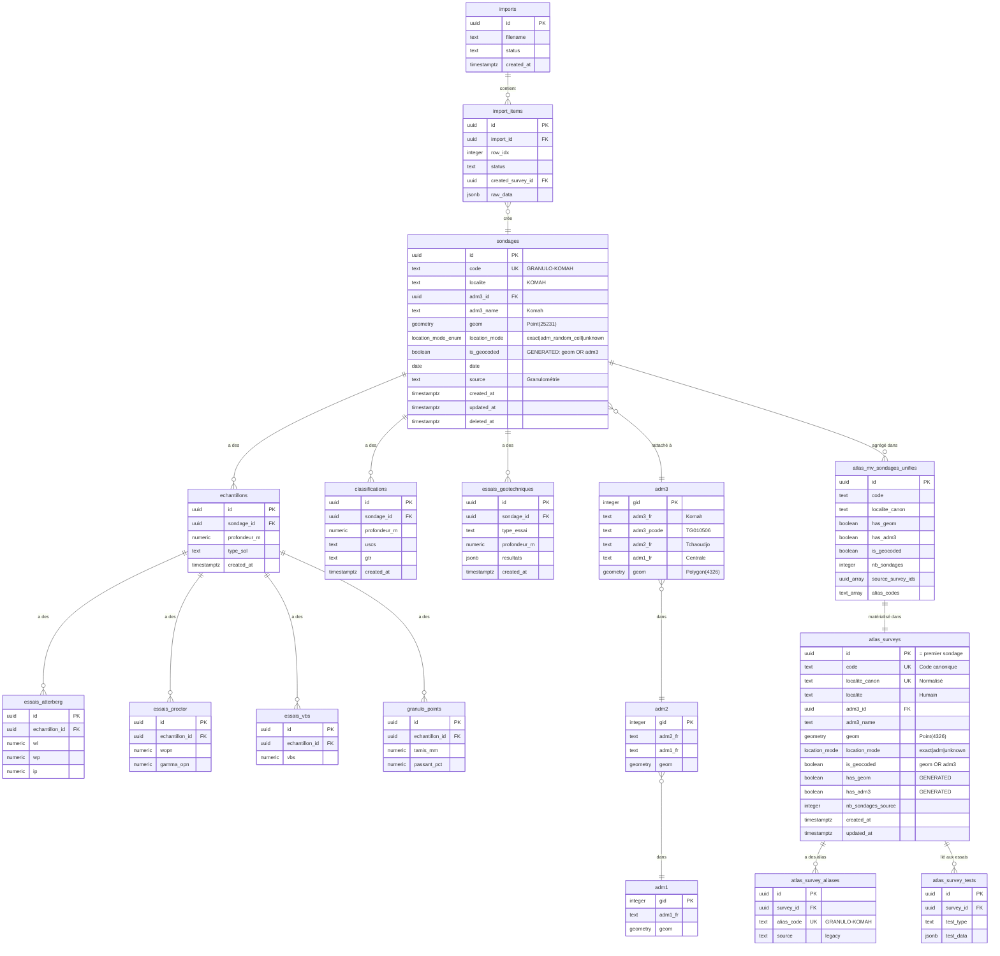
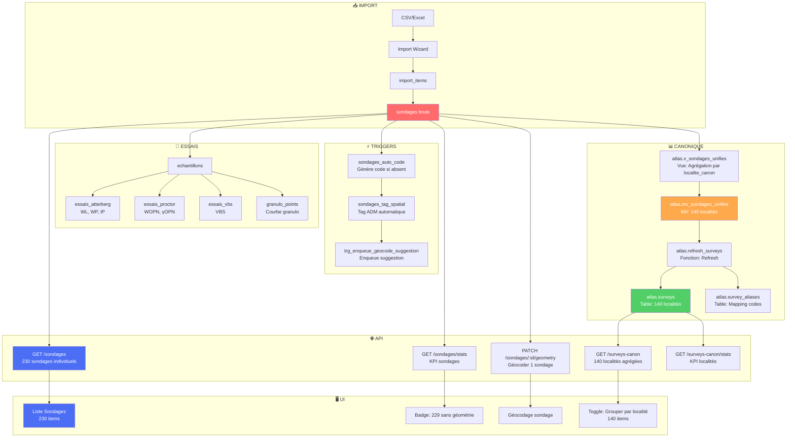

# 🗂️ SCHÉMA ERD COMPLET - Atlas Géotechnique

**Date:** 2025-11-06

---

## 📊 Diagramme Entité-Relation



---

## 🔄 Flux de Données (Data Lineage)



---

## 🔑 Fonctions Clés

### `atlas.norm(text)`

**Rôle:** Normalisation pour recherche accent-insensitive.

```sql
CREATE FUNCTION atlas.norm(text)
RETURNS text
LANGUAGE sql
IMMUTABLE
AS $$
  SELECT lower(unaccent(regexp_replace($1, '\s+', ' ', 'g')))
$$;
```

**Transformations:**
- `unaccent()`: Supprime accents (é → e)
- `regexp_replace()`: Normalise espaces
- `lower()`: Minuscules

**Exemples:**
```
"Adjengré  " → "adjengre"
"Bassar-Kpankissi" → "bassar-kpankissi"
```

### `atlas.normalize_localite(text)`

**Rôle:** Normalisation pour clé de regroupement.

```sql
CREATE FUNCTION atlas.normalize_localite(text)
RETURNS text
LANGUAGE sql
IMMUTABLE
AS $$
  SELECT atlas.norm($1)
$$;
```

### `atlas.refresh_surveys()`

**Rôle:** Rafraîchir tables canoniques depuis MV.

```sql
CREATE FUNCTION atlas.refresh_surveys()
RETURNS void
LANGUAGE plpgsql
AS $$
BEGIN
  -- 1. Refresh MV
  REFRESH MATERIALIZED VIEW CONCURRENTLY atlas.mv_sondages_unifies;
  
  -- 2. Truncate canoniques
  TRUNCATE atlas.surveys RESTART IDENTITY CASCADE;
  
  -- 3. Insérer depuis MV
  INSERT INTO atlas.surveys (...)
  SELECT ... FROM atlas.mv_sondages_unifies;
  
  -- 4. Insérer aliases
  INSERT INTO atlas.survey_aliases (...)
  SELECT id, unnest(alias_codes), 'legacy'
  FROM atlas.mv_sondages_unifies;
END;
$$;
```

### `extract_localite(text)`

**Rôle:** Extraire localité depuis code.

```sql
-- Exemple
SELECT extract_localite('GRANULO-KOMAH');
-- Retourne: 'KOMAH'
```

---

## 📊 Statistiques Actuelles

### Sondages (Brute)

```sql
SELECT 
  COUNT(*) as total,
  COUNT(*) FILTER (WHERE localite IS NOT NULL) as avec_localite,
  COUNT(*) FILTER (WHERE is_geocoded) as geocodes,
  COUNT(*) FILTER (WHERE geom IS NOT NULL) as avec_geom,
  COUNT(*) FILTER (WHERE adm3_id IS NOT NULL) as avec_adm3
FROM sondages
WHERE deleted_at IS NULL;
```

| Métrique | Valeur | % |
|----------|--------|---|
| Total | 230 | 100% |
| Avec localite | 230 | 100% |
| Géocodés | 1 | 0.4% |
| Avec géométrie | 1 | 0.4% |
| Avec ADM3 | 0 | 0% |

### Localités (Canonique)

```sql
SELECT 
  COUNT(*) as total,
  COUNT(*) FILTER (WHERE has_geom) as avec_geom,
  COUNT(*) FILTER (WHERE has_adm3) as avec_adm3,
  COUNT(*) FILTER (WHERE is_geocoded) as geocodes
FROM atlas.surveys;
```

| Métrique | Valeur | % |
|----------|--------|---|
| Total | 140 | 100% |
| Avec géométrie | 1 | 0.7% |
| Avec ADM3 | 0 | 0% |
| Géocodés | 1 | 0.7% |

---

## 🎯 Différence Clé: Sondages vs Localités

| Aspect | Sondages (`sondages`) | Localités (`atlas.surveys`) |
|--------|----------------------|----------------------------|
| **Nombre** | 230 | 140 |
| **Granularité** | 1 sondage = 1 ligne | 1 localité = N sondages |
| **Code** | GRANULO-KOMAH, BLEU-KOMAH | GRANULO-KOMAH (canonique) |
| **Géocodage** | Individuel | Appliqué à tous les sondages |
| **API** | `/sondages` | `/surveys-canon` |
| **UI** | 230 items, pas de badge | 140 items, badge "X sondages" |

**Recommandation:** Utiliser `/sondages` par défaut, avec toggle optionnel pour `/surveys-canon`.

---

## 📁 Fichiers Associés

- `docs/AUDIT_DONNEES_PART1.md` - Détails tables
- `docs/AUDIT_DONNEES_PART2.md` - Incohérences
- `docs/AUDIT_DONNEES_PART3.md` - Migrations
- `docs/AUDIT_SYNTHESE.md` - Synthèse exécutive
- `migrations/backfill_localite.sql` - ✅ Appliquée
- `migrations/fix_is_geocoded_sondages.sql` - ✅ Appliquée
- `migrations/recreate_views_with_flags.sql` - ✅ Appliquée
